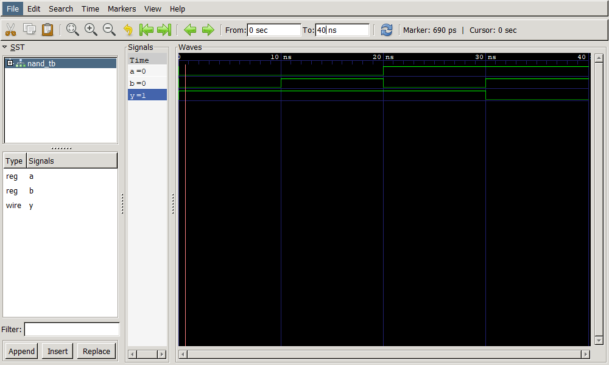

# RTL Design Basics – Verilog and Verification

## Overview

This repository contains fundamental RTL designs implemented in Verilog along with their verification using structured testbenches and waveform analysis.

The purpose of this project is to build a strong foundation in digital design and verification methodology.

---

## Design and Verification Workflow

Each design in this repository follows the same process:

1. Implement RTL in Verilog
2. Develop a testbench
3. Create a reference model for expected behavior
4. Compare DUT output with expected output (self-checking)
5. Generate waveform dump
6. Analyze using GTKWave

---

## Example: NAND Gate

### RTL Implementation

```verilog id="rtl1"
assign y = ~(a & b);
```

### Reference Model

```verilog id="ref1"
expected_y = ~(a & b);
```

### Verification Approach

* All input combinations are applied
* Output is compared against reference model
* Simulation results are checked automatically
* Waveforms are inspected for correctness

---
### Waveform



---
## Tools

* Verilog HDL
* Icarus Verilog
* GTKWave
* Git

---

## Learning Outcomes

* RTL design using Verilog
* Writing structured testbenches
* Building reference models
* Self-checking verification
* Waveform-based debugging

